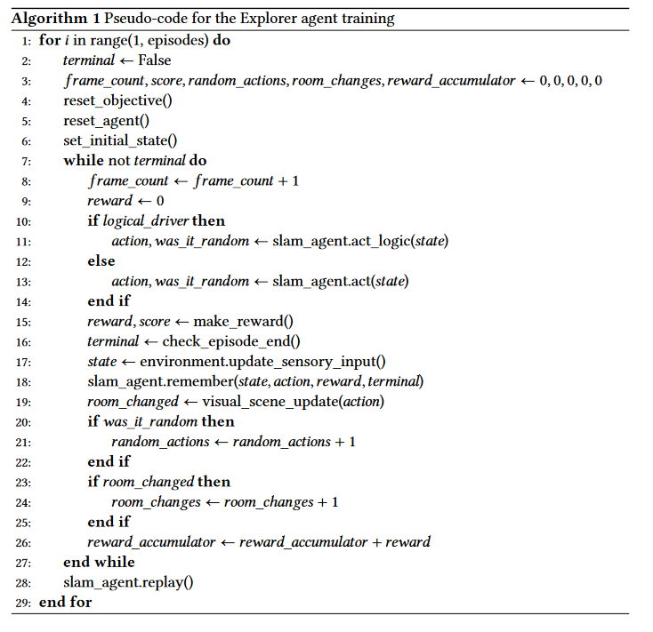

<h1 align="center"> Neuro-Symbolic Reinforcement Learning 
<div>


</h1>

## Observation 🔍

The observation simulates a set of 40 laser proximity sensors (geometrically, they are treated as segments starting from the center of the robot which collide with the environment generating intersection points which are then given to the agent) and has the shape of an array of tuples each containing 3 informations:
- Angle: the angle of the direction the sensor was facing, relative to the environment ([0,359]);
- Distance: the distance between the agent and the eventual point of intersection found (a high number is set instead if nothing was hit);
- isObject: boolean flag telling the agent whether the eventual point hit an objective or not (assumes the agent can recognize objectives);

## Actions 🕹️

There are 3 possible actions: rotate right by 45°, rotate left by 45° or move in the faced direction.

## Task 🎯

The task is to collect as many objectives as possible within 1500 time steps (approximately 15 seconds). The agent provided in the code succeedes in completing the task and definitely outperforms a human player. Reward is 1 for every objective collected.

## Reward 🎁

- reward = -1, small penalty after every 10 frames elapsed. This prevents dawdling.
- reward = 1, for changing rooms. Reinforces systematic area coverage.
- reward = 3, for looking towards target when in same room. Aligns with goal-finding.
- reward = 5, for moving towards target. Motivates motion planning.
- reward = 10, for reaching target; this strongly reinforces successful mission completion.

## Neural network

The agent uses a fully connected feedforward neural network model for navigation policy learning.

- the input layer takes in a 40-element vector representing preprocessed sensor data from the environment.
- initial hidden layers use densely connected nodes to identify low-level patterns in the input data.
- a utility flatten layer condenses the multidimensional input into a 1D array.
- hidden layers employ ReLU activation for non-linearity.
- a softmax output layer allows comparison of the 3 discrete movement options.
- the loss function used for training is Mean Square Error.
- the optimization algorithm is Adam, a form of stochastic gradient descent.

## Symbolic Logic Supervisor 📝

The agent uses a symbolic logic module to provide high-level navigation behaviors and enable the neural network to focus learning on lower-level motion.
To enable it push *logic drive on*.

### Capabilities

The logic supervisor handles:
- obstacle avoidance
- door detection

It uses the same sensory inputs as the neural network to perceive obstacles.

For doors, we simulate Bluetooth emitters in a 1-2 meter range that are detectable when nearby.

The logic rules have highest priority, overriding the network outputs if necessary.

### Rules

Two simple logic rules encode the obstacle and door behaviors:
```
obtstacleE(D) :>  
  direction(D),
  right(D), rotateA(left_angle); 
  left(D), rotateA(right_angle);

seen_door(D) :> 
  direction(D), 
  rotateA(D), 
  forwardA(1).

```
The first rule rotates the agent away from obstacles detected in direction D.

The second rule faces the agent towards detected doors in direction D and moves forward.

### Advantages

- avoid countless collisions by rotating away from obstacles.
- enable strategic room navigation by encoding the concept of doors.
- prevent wandering behavior before grasping spatial logic.

## Training 🏃‍♂️

----------------------------------------------------------------------------------

## Installation 🪛

- make sure you have clean python paths, taking care of the `.local` directory as well.
- make sure to delete all `__pycache__` and other temporary files from your project.
- make sure you do not have conflicting conda installations.
- clone the repo.
- start a terminal inside the cloned directory.
- ` curl https://repo.anaconda.com/miniconda/Miniconda3-latest-Linux-x86_64.sh -o Miniconda3-latest-Linux-x86_64.sh `
- ` bash Miniconda3-latest-Linux-x86_64.sh `
- ` conda create --name tf python=3.9 `
- ` conda deactivate `
**Restart the terminal**
- ` conda activate tf  `
- ` conda install -c conda-forge cudatoolkit=11.8.0 `
- ` pip install nvidia-cudnn-cu11==8.6.0.163 `
- ` CUDNN_PATH=$(dirname $(python -c "import nvidia.cudnn;print(nvidia.cudnn.__file__)")) `
- ` export LD_LIBRARY_PATH=$LD_LIBRARY_PATH:$CONDA_PREFIX/lib/:$CUDNN_PATH/lib `
- ` mkdir -p $CONDA_PREFIX/etc/conda/activate.d `
- ` echo 'CUDNN_PATH=$(dirname $(python -c "import nvidia.cudnn;print(nvidia.cudnn.__file__)"))' > $CONDA_PREFIX/etc/conda/activate.d/env_vars.sh`
- ` echo 'export LD_LIBRARY_PATH=$LD_LIBRARY_PATH:$CONDA_PREFIX/lib/:$CUDNN_PATH/lib' > $CONDA_PREFIX/etc/conda/activate.d/env_vars.sh `
- ` pip install --upgrade pip `
- ` pip install tensorflow==2.12.* `
- ` python3 -c "import tensorflow as tf; print(tf.config.list_physical_devices('GPU'))" `
- ` rm -rf Miniconda3-latest-Linux-x86_64.sh `
- ` conda install -c conda-forge opencv `
- ` pip install -r requirements.txt `

## Acknowledgements

The code in this repository is adapted from the public implementation available at:
https://github.com/AAAI-DISIM-UnivAQ/bd-procedural-env-deep-learning/tree/master
